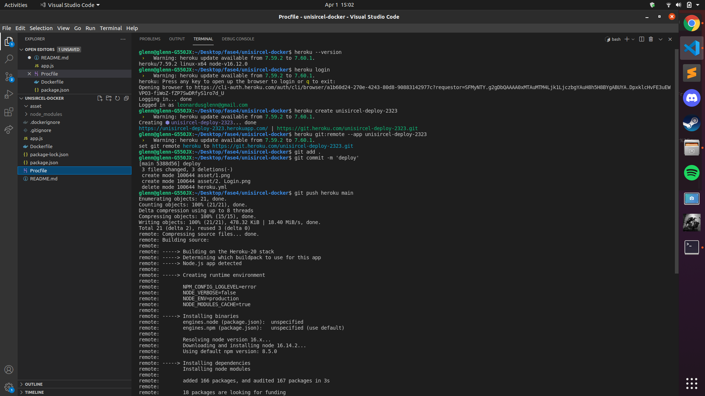

DEVOPS Unsircle Interview and Testing

Devops Interview Question :
1. What is “DevOps”? 
    DevOps adalah filosofi atau tools yang digunakan developer untuk memudahkan dalam kegiatan developing sebuah aplikasi
1. What are some of the most popular DevOps tools? 
    GitHub, Docket, and Kubernetes
1. What are the main differences from Agility? -
1. What’s Version control? 
    Menstandartkan enviroment versi tools yang digunakan
1. What are the 4 key components of DevOps? 
1. What are the programming languages that are used in DevOps? 
    Python, Javascript
1. How does AWS fit into DevOps?
1. What is ‘Extreme Programming’? 
    software development framework yang digunakan untuk meningkatkan kualitas aplikasi 
1. What is a ‘design pattern’? 
    pola design struktur folder yang digunakan developer untuk memudahkan debugging
1. What is CBD’s?

Knowladge Devops :
1. Explain ‘branching’?  
    branching adalah suatu percabangan dari tulisan code yang digunakan untuk kolaborasi dalam mendevelope sebuah aplikasi 
1. How to copy Jenkins to another server? -
1. Name three methods that you’d use to secure Jenkins? -
1. Describe ‘automation testing’? 
    automation testing adalah suatu kegiatan yang digunakan untuk memastikan code yang dibuat sudah jalan sesuai dengan yang diinginkan
1. What are the main benefits of using ‘automation testing’? 
    untuk memastikan bahwa code yang kita buat sudah sesuai dengan keinginan kita
1. What’s Memcached? 
    Proses yang digunakan untuk menyimpan informasi
1. Why is the component of Continuous Testing so important for DevOps?
1. Is Selenium a good testing tool? How can you maximize the efficiency of Continous
Integration?
1. Explain what is Ansible and give the advantages and disadvantages of using Ansible?
1. Which linux command can be used to find a file in a directory? 
    ls
1. To find out the list of linux commands that have been used before, what command for
this fuction? -
1. Define SQL and NoSQL databases according to you, and give examples of each database
that you have mentioned? 
    sql memiliki coloum data yang kurang dinamis, nosql memiliki coloumn data yang dinamis,

Testing
1. Install a web server application on your computer, then install Docker, Kubernetes for
deploy the web app.
1. Deploy a project that at heroku and using heroku-cli, include a screenshot and describe
it step by step or record it into a video.  (Baru pake docker dan deploy dengan heroku)
step by step :
```
1. Install heroku
2. Login heroku
3. Create project
    ```bash
    heroku create unisircel-deploy-2323
    ```
4. Tambahkan file Procfile dengan isi
    ```
    web: npm start
    ```
5. Masuk git remote yang disediakan heroku
    ```bash
    heroku git:remote --app unisircel-deploy-2323
    ```
6. Push pada remote heroku
    ```bash
    git add .
    git commit -m 'deploy'
    git push origin main
    ```

```
referensi: 
